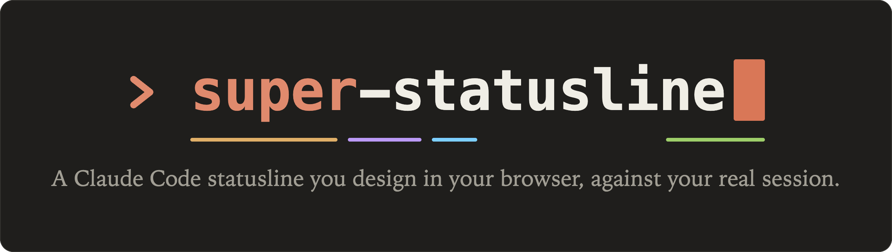
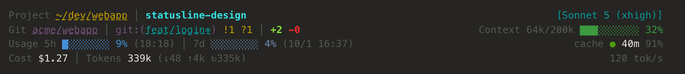
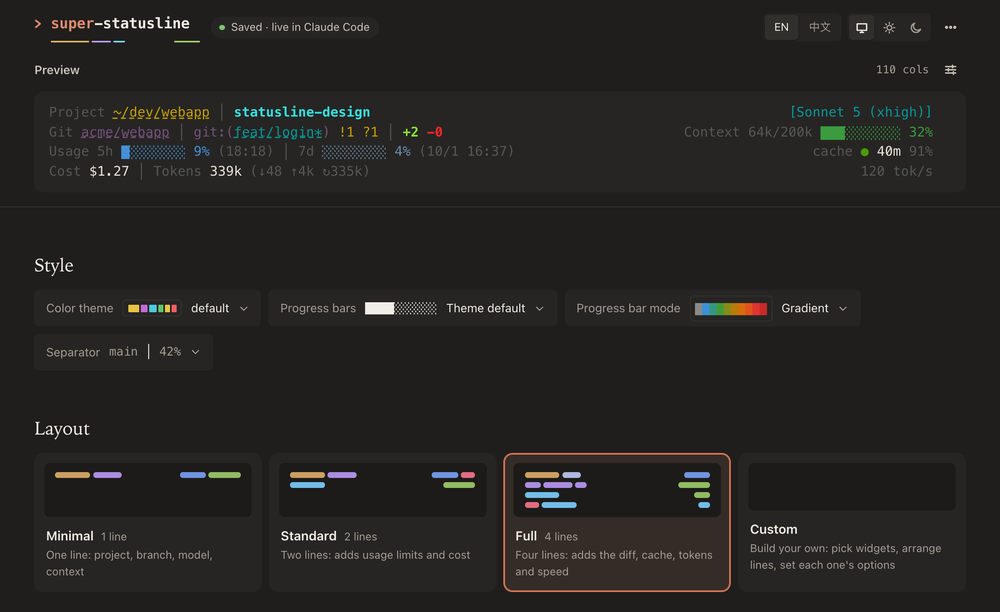
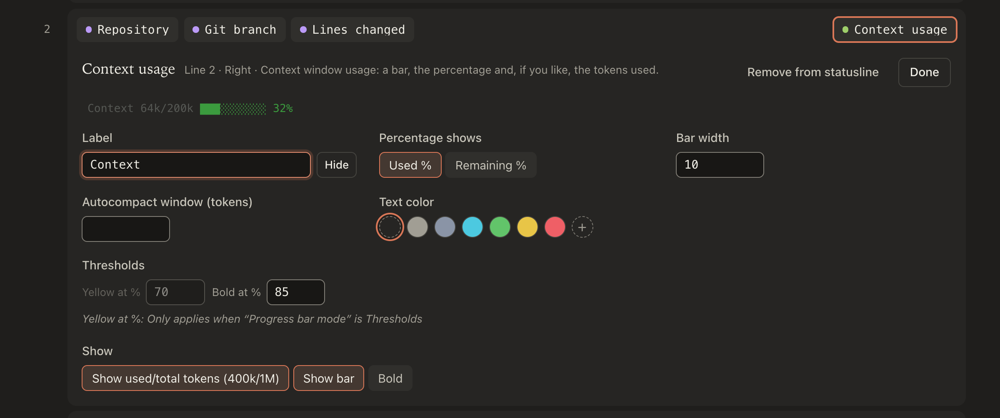

<h1 align="center">
  <picture>
    <source media="(prefers-color-scheme: light)" srcset="docs/images/banner-light.png">
    
  </picture>
</h1>

<picture>
  <source media="(prefers-color-scheme: light)" srcset="docs/images/statusline-light.png">
  
</picture>

*The Full preset with gradient bars, on the bundled sample session (`src/fixtures/basic.json`).*

* **Web configurator** — presets or your own layout, drag or keyboard, options under each widget; the preview
  draws your real session and tries a theme, bar or separator on before you apply it. English and 简体中文.
* **42 widgets** — model, git, PR, context, rate limits, cache, tokens, cost, agents, todos, tools, MCP…, plus your
  own `.ts`/`.js` plugins.
* **Fast & local** — ~20 ms per render, even on 100 MB transcripts; slow git never blocks the line; no network.

Requires Claude Code ≥ 2.1.251 and [Bun](https://bun.sh) on `PATH`.

## Quick start

```bash
claude plugin marketplace add jinhuang712/claude-code-super-statusline
claude plugin install super-statusline@claude-code-super-statusline
```

Then run `/super-statusline:config` in Claude Code. It opens the configurator on `127.0.0.1:4877`, previewing that
session. Your first edit applies the statusline to `~/.claude/settings.json` (a backup is kept); if you already use
another statusline, the panel asks first, and *⋯ → Stop using this statusline* puts it back. Later edits save
automatically and show on the next refresh.

<picture>
  <source media="(prefers-color-scheme: light)" srcset="docs/images/configurator-light.png">
  
</picture>

Pick *Custom* to edit the lines: click a widget to open its options right under it.



<details>
<summary>Upgrading from claude-code-ssp (≤ 0.3.x, <code>/ssp:config</code>)</summary>

The rename can't carry an install over by itself. Install the new plugin (above), run `/super-statusline:config` once —
it repoints your statusline and moves `~/.config/claude-code-ssp/` and `~/.claude/plugins/claude-code-ssp/` to the new
names — then remove the old one:

```bash
claude plugin uninstall ssp@claude-code-ssp
claude plugin marketplace remove claude-code-ssp
```

Project files are never moved (they may be committed): `.claude/claude-code-ssp.json` and
`.claude/claude-code-ssp/widgets/` keep working where they are.
</details>

## Commands

`bun src/cli/main.ts <command>` from a checkout:

| Command | Purpose |
|---|---|
| `render` | stdin JSON → statusline (what Claude Code runs); `--fixture src/fixtures/basic.json` to try it |
| `serve [--port N] [--open]` | the web configurator |
| `serve --sandbox` | the same on `:4878`, against throwaway copies of your config, samples and statusLine |
| `install [--dry-run] [--replace]` / `uninstall` | add or remove our `statusLine` in settings.json (the one it replaced is restored) |
| `reset [--session ID] [--undo]` | restart a session's cost / tokens / API calls / lines-changed counters from zero (also *⋯ → Reset counters*) |
| `doctor` | the panel's *Diagnostics*, for terminals without a browser |

## Config

`~/.config/claude-code-super-statusline/config.json`, overlaid by a project's
`.claude/claude-code-super-statusline.json`. Objects deep-merge, `lines` replaces wholesale, and it is re-read on
every render. The panel writes only what you changed, to the file you chose in its header.

```jsonc
{
  "theme": "tokyo-night",       // default | nord | dracula | gruvbox | tokyo-night | catppuccin | mono | {…inline}
  "colorLevel": "auto",         // auto | truecolor | 256 | 16 | none
  "colorMode": "thresholds",    // thresholds | gradient — how every bar and percentage is coloured
  "separator": " │ ",
  "columnsOffset": 2,           // cells reserved for Claude Code's own footer padding
  "lines": [
    { "left":  [{ "widget": "project.path", "options": { "levels": "tilde" } }, { "widget": "git.branch" }],
      "right": [{ "widget": "model.badge" }, { "widget": "cost.session" }] },
    { "left":  [{ "widget": "usage.windows", "options": { "bar": true } }],
      "right": [{ "widget": "context.bar" }], "overflow": "wrap" }
  ],
  "git": { "enabled": true, "cacheMs": 2000 },
  "plugins": { "dirs": [], "trustedProjects": [] },
  "captureSamples": true
}
```

A widget instance is `{ "widget": "<id>", "options": {…}, "style": { "fg", "bg", "bold", … }, "label": "…" | null }`.
Colours are theme tokens (`fg muted accent ok warn crit model project git usage context`), literals (`#rrggbb`,
`208`, `red`) or `default`, the terminal's own colour — which every built-in theme uses for values, so they read on
light terminals too.

`colorMode` (*Style → Progress bar mode*) applies to every percentage widget: `thresholds` turns a value yellow at
the widget's *Yellow at %* and red at *Red at %*; `gradient` runs grey → blue → green → yellow → orange → red with the
percentage (*Red at %* then only makes it bold). Configs from ≤ 0.4.1, where each widget had its own, read as
`gradient` if any widget used it.

## Security

* The configurator listens on `127.0.0.1` and only answers requests whose `Host` and `Origin` are its own, so other
  pages can't read your sessions or change settings (DNS rebinding included). No CORS.
* **Project widgets are code**: `<project>/.claude/claude-code-super-statusline/widgets/*` loads only for projects in
  `plugins.trustedProjects` of your *user* config (*⋯ → Diagnostics → Trust this project*). A project can't trust itself.
* The preview renders only captured samples and bundled fixtures, never a path a request supplies.

## Writing a widget

```ts
// ~/.config/claude-code-super-statusline/widgets/hello.ts
export default {
  id: "example.hello", name: "Hello", description: "…", category: "misc",
  schema: { type: "object", properties: { name: { type: "string", default: "friend" } } },
  defaults: { name: "friend" },
  render(ctx, opts, api) {                    // ctx: stdin, transcript, gitStatus, columns, now, theme …
    return [api.seg(`👋 ${opts.name}`, { fg: "accent" })];
  },
};
```

A broken plugin shows `⚠` instead of blanking the line. An option that only matters while another is set can say
so — `"x-requires": { "bar": true }`, or `"x-requires-config": { "colorMode": "thresholds" }` for a top-level
key — and the panel dims it. Colour a percentage with `api.levelColor(pct, api.level(pct, warnAt, critAt), "fg")` to
follow the user's Progress bar mode. See `examples/widgets/`, `src/widgets/` and `DESIGN.md`; restart the configurator
to see a new widget under *Unused widgets*.

## Development

```bash
bun install
bun test                  # layout, config, server security, install, option sweep, web build freshness…
bun run typecheck
bun run serve:sandbox     # configurator on :4878 against temp copies — safe to click around or automate
bun run dev:web           # Vite on :5178, proxying /api → :4877 (run `bun run serve` alongside)
bun run build:web         # rebuild web/dist — committed, so marketplace installs need no build
scripts/ui-smoke.sh       # headless browser check of the configurator (playwright-cli)
```

## License

MIT (see `LICENSE`). `src/data/` is derived from [claude-hud](https://github.com/jarrodwatts/claude-hud) © Jarrod
Watts, MIT — see `licenses/claude-hud.LICENSE`.
