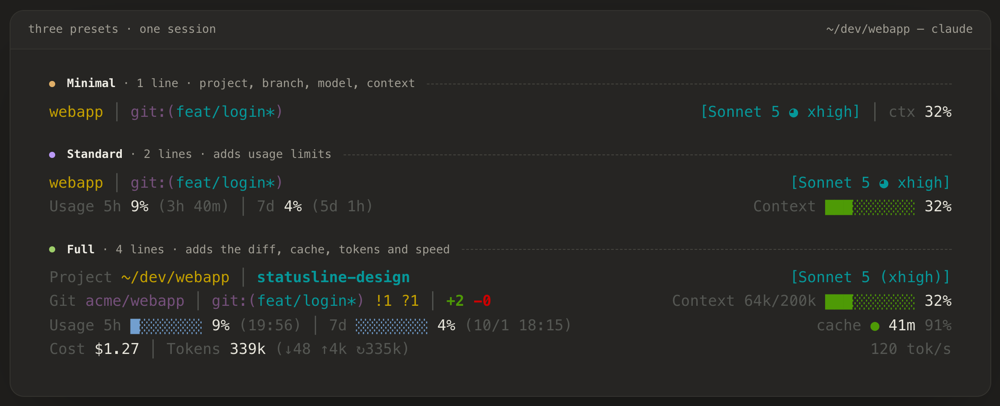
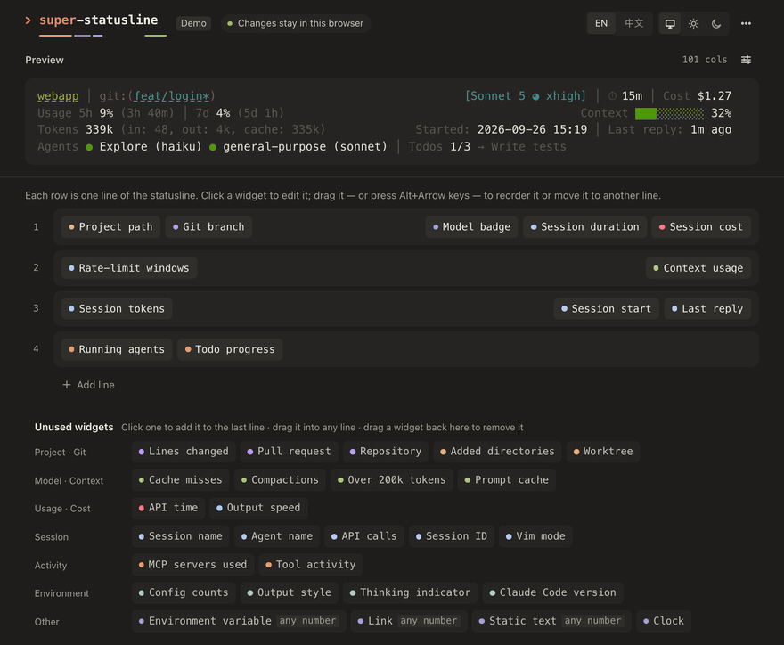

<h1 align="center">
  <picture>
    <source media="(prefers-color-scheme: light)" srcset="docs/images/banner-light.png">
    
  </picture>
</h1>

<picture>
  <source media="(prefers-color-scheme: light)" srcset="docs/images/presets-light.png">
  
</picture>

## Install

```bash
curl -fsSL https://raw.githubusercontent.com/jinhuang712/claude-code-super-statusline/main/install.sh | bash
```

Then run `/super-statusline:config` in Claude Code and pick a layout. The script checks for [Bun](https://bun.sh)
(and offers to install it); run it again any time to update. Installing by hand, uninstalling and upgrading:
[INSTALL.md](INSTALL.md).

## Drag and drop

Start from a preset, then arrange it by hand — the preview redraws as you go:

* **Drag a widget** from *Unused widgets* onto any line, left or right.
* **Drag it again** to reorder it, or to move it to another line — or focus it and press <kbd>Alt</kbd> + arrow keys.
* **Drag it back** to the tray to remove it (or click it and choose *Remove from statusline*).

<picture>
  <source media="(prefers-color-scheme: light)" srcset="docs/images/dnd-light.gif">
  
</picture>

## What you can change

<picture>
  <source media="(prefers-color-scheme: light)" srcset="docs/images/configurator-light.png">
  
</picture>

* **Layout** — *Minimal*, *Standard* or *Full*, or *Custom* to build your own lines by dragging.
* **Color theme** — default, nord, dracula, gruvbox, tokyo-night, catppuccin, mono.
* **Progress bars** — the bar glyphs: full block, tall, low, half, slanted, squares, line, dots.
* **Progress bar mode** — thresholds (green → yellow → red) or a smooth gradient.
* **Separator** — `│` `·` `•` `/` `|` `❯`, or your own.
* **Each widget** — in *Custom*, click a widget to change its label, colour and options:


The preview shows your real session; hover a choice to try it before you click. English and 简体中文.

## Widgets

**Project · Git**

| Widget | Shows |
|---|---|
| Project path | The working directory — name only, last few folders, `~/…` or the full path |
| Worktree | The active git worktree, and the branch it came from |
| Added directories | Folders added with `/add-dir` |
| Repository | `owner/name` of the repo |
| Git branch | Branch, uncommitted changes, ahead/behind |
| Lines changed | Lines added / removed, by this session or uncommitted |
| Pull request | The branch's open PR and its review state |

**Model · Context**

| Widget | Shows |
|---|---|
| Model badge | The model, with effort level, provider and fast mode if you like |
| Effort level | Reasoning effort as a symbol and/or word |
| Context usage | How full the context window is: bar, percentage, tokens |
| Prompt cache | Whether the prompt cache is warm, and when it expires |
| Cache misses | Cache misses out of all requests, and why the last one happened |
| Compactions | How many times the session was compacted |
| Over 200k tokens | A flag while the last request was over 200k tokens |

**Usage · Cost**

| Widget | Shows |
|---|---|
| Rate-limit windows | 5-hour, 7-day and spend-limit usage (Pro/Max), with reset times |
| Session tokens | Tokens used this session, with an in/out/cache breakdown |
| Output speed | Tokens per second of the latest reply |
| Session cost | What the session has cost |
| API time | Time spent waiting on the API |

**Session**

| Widget | Shows |
|---|---|
| Session name | The session's title |
| Session duration | Time since the session started |
| Session start | When the session started |
| Last reply | How long ago Claude last replied |
| API calls | Number of model turns |
| Session ID | The session id (short, or the full one `claude --resume` takes) |
| Agent name | The agent, when running with `--agent` |
| Vim mode | The current vim mode |

**Activity**

| Widget | Shows |
|---|---|
| Running agents | Subagents running right now |
| Todo progress | Todos done out of total, and the current one |
| Tool activity | The latest tool calls and how they went |
| MCP servers used | MCP servers called this session, failing ones flagged |

**Environment**

| Widget | Shows |
|---|---|
| Config counts | CLAUDE.md files, rules, MCP servers and hooks in effect |
| Output style | The output style, when it isn't the default |
| Thinking indicator | 💭 while extended thinking is on |
| Claude Code version | The Claude Code version |

**Other**

| Widget | Shows |
|---|---|
| Static text | Any text or symbol you type |
| Link | Clickable text |
| Environment variable | The value of a variable, e.g. `AWS_PROFILE` |
| Clock | The current time |

## More

* [INSTALL.md](INSTALL.md) — install, uninstall, upgrading from claude-code-ssp
* [ADVANCED.md](ADVANCED.md) — the config file, command line, your own widgets, security, development
* [DESIGN.md](DESIGN.md) — how it works inside
* [CHANGELOG.md](CHANGELOG.md)

## License

MIT. `src/data/` is derived from [claude-hud](https://github.com/jarrodwatts/claude-hud) © Jarrod Watts, MIT.
